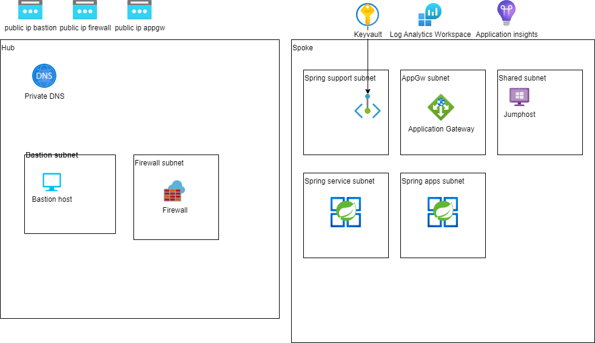

# A Hardened Spring Apps Microservices starter. (WORK IN PROGRESS) 
Based on [Azure Spring Apps Landing Zone Accelerator} (https://github.com/Azure/azure-spring-apps-landing-zone-accelerator)

This is a hardened microservice application with a separate frontend and a BFF.


## Hardenings (work in progress)
Over the LZA blueprint following hardenings are added
[] AAD Administrator for PostgreSQL
[] Managed identity connections
[] EGRESS firewalling from Spring Apps

## Application level changes

[] Improvements on observability
[] FE - BFF - BE architecture
[] Event driven microservices

## Terraform State Management

In this example, state is stored in an Azure Storage account that was created out-of-band.  All deployments reference this storage account to either store state or reference variables from other parts of the deployment however you may choose to use other tools for state management, like Terraform Cloud after making the necessary code changes.

## Terraform Variable Definitons File

In this example, there is a common variable defintions file [parameters.tfvars](./infra/parameters.tfvars) that is shared across all deployments. Review each section and update the variable definitons file as needed. 

## Prerequisites 


If not already registered in the subscription, use the following Azure CLI commands to register the required resource providers for Azure Spring Apps:

    ```bash
    az provider register --namespace 'Microsoft.AppPlatform'
    az provider register --namespace 'Microsoft.ContainerService'
    az provider register --namespace 'Microsoft.ServiceLinker'
    ```

Obtain the ObjectID of the service principal for Azure Spring Apps. This ID is unique per Azure AD Tenant. In Step 4, set the value of variable SRINGAPPS_SPN_OBJECT_ID to the result from this command.

    `az ad sp show --id e8de9221-a19c-4c81-b814-fd37c6caf9d2 --query id --output tsv`


Modify the variables within the Global section of the variable definitons file paramaters.tfvars as needed

    ```bash
    # EXAMPLE
    
    ##################################################
    ## Global
    ##################################################
    # The Region to deploy to
    location = "eastus"

    # This Prefix will be used on most deployed resources.  10 Characters max.
    # The environment will also be used as part of the name
    name_prefix = "springent"
    environment = "dev"

    # Specify the Object ID for the "Azure Spring Apps Resource Provider" service principal in the customer's Azure AD Tenant
    # Use this command to obtain:
    #    az ad sp show --id e8de9221-a19c-4c81-b814-fd37c6caf9d2 --query id --output tsv
    SPRINGAPPS_SPN_OBJECT_ID = "<change this>"

    # tags = { 
    #    project = "ASA-Accelerator"
    #    deployenv = "dev"
    # }
    ```
  
## Deployment

1. [Creation of Azure Storage Account for State Management](./infra/01-State-Storage.md)

2. [Creation of the Hub Virtual Network & its respective components](./infra/02-Hub-Network.md)

3. [Creation of Landing Zone (Spoke) Network & its respective Components](./infra/03-LZ-Network.md)

4. [Creation of Shared components for this deployment](./infra/04-LZ-SharedResources.md)
 
5. [Creation of Azure Firewall with UDRs](./infra/05-Hub-AzureFirewall.md)

6. [Creation of Azure Spring Apps](./infra/06-LZ-SpringApps.md)

7. [Optional: Creation of Application Gateway](./infra/07-LZ-AppGateway.md)

8. [Cleanup](./infra/08-cleanup.md)

9. [E2E Deployment using GitHub Action for Azure Spring Apps Standard](./infra/09-e2e-githubaction-standard.md)
    


## Known Issues

- Please take the following actions before attempting to destroy this deployment.
  - Turn on the Jump Box Virtual Machine
  


